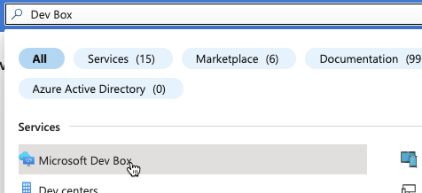
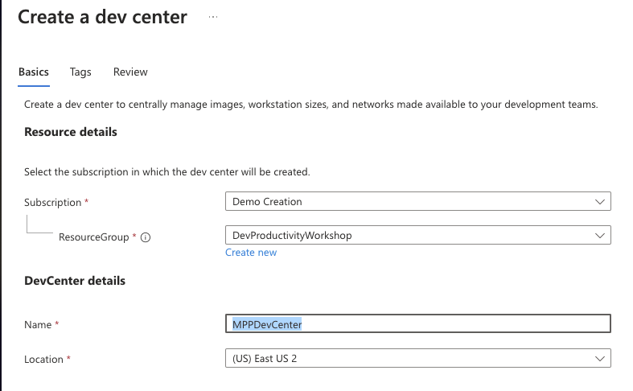
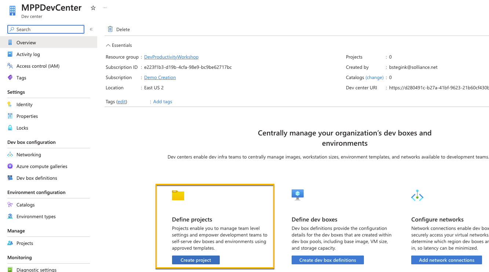
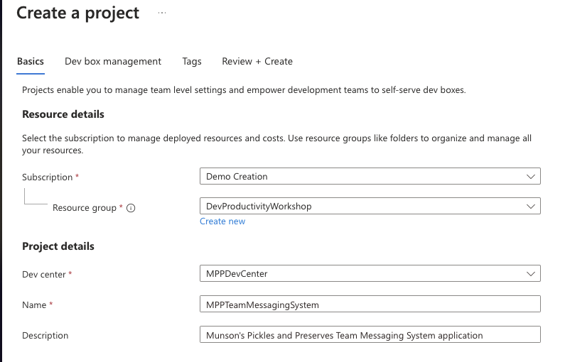
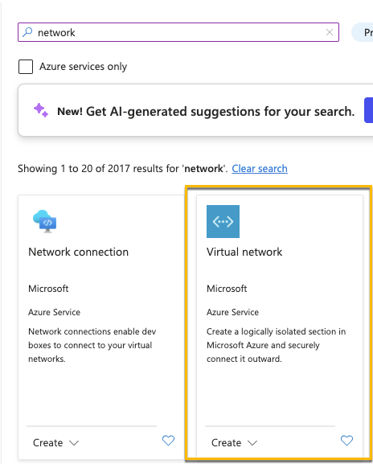
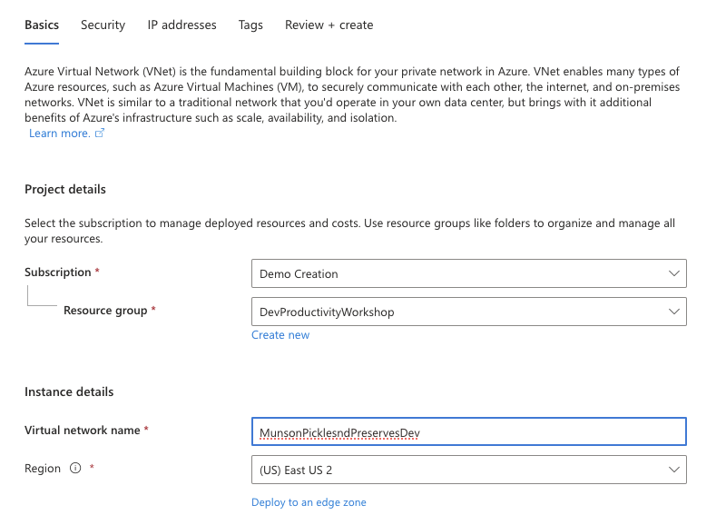
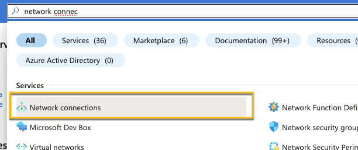
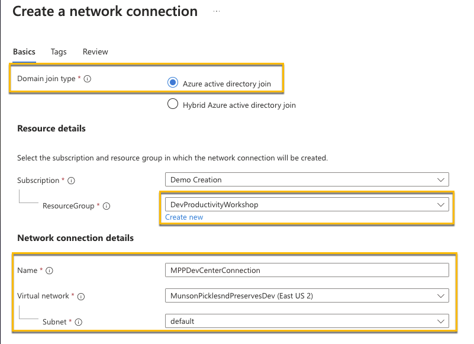
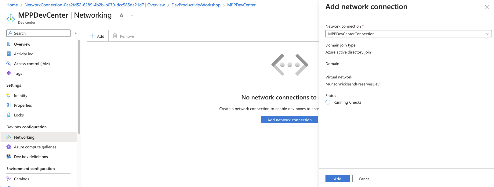

# Task 01 - Deploy the necessary prerequisites required for a Microsoft Dev Box (20 minutes)

## Introduction

Before standing up Dev Boxes for the developers at Munson's Pickles and Preserves to use, there are certain prerequisite tasks that need to be done in order to ensure that you have the right permissions and network access in place and can access the resources required for the rest of these exercises.

In this first task you will walk through some of those base configurations that are needed to stand up a Microsoft Dev Box in Azure. This includes a Dev Center where all the projects will live. The projects where you can add the virtual machines configured specifically for that project, as well as the network these development virtual machines will be attached to. This ensures users can login with the Azure AD account as well as that they are able to access other resources on the network.

## Description

Microsoft Dev Box requires the proper infrastructure and resources to be deployed in Azure before you can start deploying  machines for users. In this exercise, you'll prep your Azure environment for deploying Dev Boxes.

## Success Criteria

- Create a Dev Center
- Create a Project
- Setup the dev center so dev boxes are joined to Azure AD (Microsoft Entra)
  - Create a vNet (if needed) - use an existing vNet or create a new one for the network connection
  - Create a network connection and add it to the dev center

## Learning Resources

- [Microsoft Dev Box Prerequisites](https://learn.microsoft.com/azure/dev-box/quickstart-configure-dev-box-service?tabs=AzureADJoin#prerequisites)

## Tips

- [Step-by-step to create a dev center and project](https://learn.microsoft.com/azure/dev-box/quickstart-configure-dev-box-service?tabs=AzureADJoin#1-create-a-dev-center)
- [Step-by-step to create a Dev Box network and network connection](https://learn.microsoft.com/azure/dev-box/quickstart-configure-dev-box-service?tabs=AzureADJoin#2-configure-a-network-connection)
- [If you want to use an ARM template, configure a Dev Box by using an ARM template](https://learn.microsoft.com/azure/dev-box/quickstart-configure-dev-box-arm-template)

## Related features not covered in this lab

- [Template Catalogs for Azure Deployment Environments](https://learn.microsoft.com/azure/deployment-environments/how-to-configure-catalog)
- [Environment definitions for Dev Center Projects](https://learn.microsoft.com/azure/deployment-environments/configure-environment-definition)

## Solution

Expand this section to view the solution

1. Navigate to Azure and create a new Resource Group for the Lab
2. In the search box, find Microsoft Dev Box

   
3. Select Dev centers and click to create a new one
4. Use a name like MPPDevCenter for the Dev center name
   
5. Once you're in your Dev Center, Create a new project
   
6. Create a project for the Munson's Pickles and Preserves Team Messaging System application
7. 
   1. Leave Dev Box management with the defaults, if you wanted to set a limit on the number of dev boxes a user could create you can do that here.
8. Go back to the Azure Portal and your Resource Group and create a new Virtual network
    
    
    You can keep Security and IP addresses to the defaults and create the network
9. Create a new Network Connection in the resource group
    
10. Make sure it's in your same resource group and the domain join type is set to Azure active directory join. In the network connection details connect it to the network you just created.
    
11. Once the network connection is created, navigate back to your Dev Center and under Networking add the network connection you just created.
    
    You can add it before the checks are finished running, they will continue to run once it's been added.

Now you're ready to start creating a custom image to deploy your Dev Box.

