# Task 03 - Deploy a Microsoft Dev Box (10 minutes)

## Description

In this task you'll deploy a new dev box. Once it's deployed, you'll verify that you can log in to the Dev Box and that the tools you configured in your custom image are included in the dev box.

## Success Criteria

Log into a dev box and configure any necessary software to be able to use that image to create and run a development box.

- Create a dev box definition with a custom image

{: .important }
> **Custom Images** It can take anywhere from 20 minutes to an hour to validate the VM definition created from the custom image. If it still hasn't completed after 15 or 20 minutes, you can continue on with the lab using a different machine. Once the verification is successful you can come back to finish Task 3. It is ok to use your own computer for Day 1 and use the Dev Box on day 2.

- Create a dev box pool within your project
- Create and log in to your own dev box and use the tools you configured in the custom image
- Install the necessary software on your Dev Box
  - If you used your custom image, install:
    - Docker
  - If your validation failed and you used a standard image, install the following.
    - Docker ([https://docs.docker.com/desktop/install/windows-install/](https://docs.docker.com/desktop/install/windows-install/))
    - Visual Studio Code ([https://code.visualstudio.com/Download](https://code.visualstudio.com/Download))
    - Java (for JMeter) ([https://www.java.com/en/download/](https://www.java.com/en/download/))
    - Apache JMeter ([https://dlcdn.apache.org//jmeter/binaries/apache-jmeter-5.6.3.zip](https://dlcdn.apache.org//jmeter/binaries/apache-jmeter-5.6.3.zip))
    - Azure Storage Explorer ([https://azure.microsoft.com/products/storage/storage-explorer/](https://azure.microsoft.com/products/storage/storage-explorer/))
    - Git bash ([https://git-scm.com/download/win](https://git-scm.com/download/win))
    - .NET SDK 8.0 LTS ([https://dotnet.microsoft.com/download/visual-studio-sdks](https://dotnet.microsoft.com/download/visual-studio-sdks))
    - Firefox ([https://www.mozilla.org/en-US/firefox/new/](https://www.mozilla.org/en-US/firefox/new/))

## Learning Resources

- [Quickstart: Configure Microsoft Dev Box](https://learn.microsoft.com/azure/dev-box/quickstart-configure-dev-box-service?wt.mc_id=mdbservice_acomdoc01_webpage_cnl&tabs=AzureADJoin)
- [Create a dev box by using the developer portal](https://learn.microsoft.com/azure/dev-box/quickstart-create-dev-box?wt.mc_id=mdbservice_acomdoc02_webpage_cnl)
- [Configure a managed identity for a dev center](https://learn.microsoft.com/azure/deployment-environments/how-to-configure-managed-identity)

## Tips

- To access the Dev Portal for logging in as a user visit: [https://devportal.microsoft.com/](https://devportal.microsoft.com/).
- Ensure you assign the [appropriate RBAC roles](https://learn.microsoft.com/azure/dev-box/how-to-dev-box-user) for the users who to access the dev portal to login to a virtual machine.
- The first time you need a virtual machine, you need to first create it. It can take a little bit to create the VM the first time.

{: .note }
> It's possible that Docker for Desktop causes issues following the creation of your Dev Box due to the custom image. To resolve, it may need to be uninstalled/reinstalled once your Dev Box is created.

## Solution

Part 1: Expand this section to view the solution for creating a standard Dev Box Definition if you validation of your custom image fails.

1. In the Azure Portal, navigate to the Dev center you created in Task 1, and select Dev box definitions.
    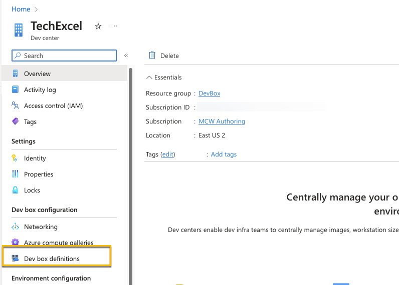
2. Select +Create
    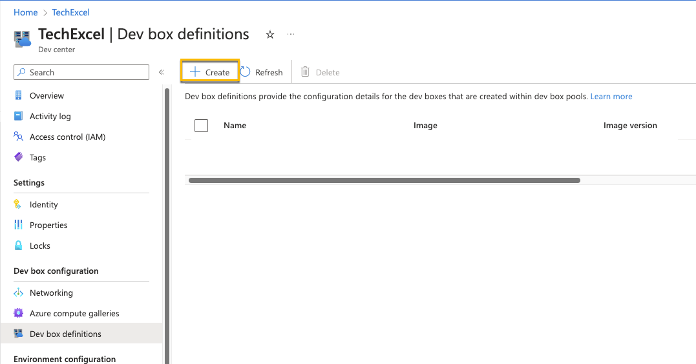
3. Create a new dev box definition with the following settings and select Create.
     - Name: "TechExcel-Dev-Box"
     - Image: Windows 11 Enterprise + OS Optimizations 22H2
     - Image version: Latest
     - Compute: 8vCPU, 32 GB RAM
     - Storage: 256 GB SSD

    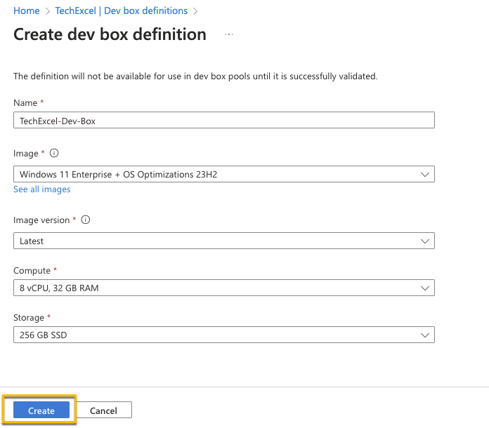

Part 1: Expand this section to view the solution for creating a custom Dev Box Definition using your custom image.

1. Navigate back to your Dev Center, go to Identity and turn on a system assigned Managed Identity
   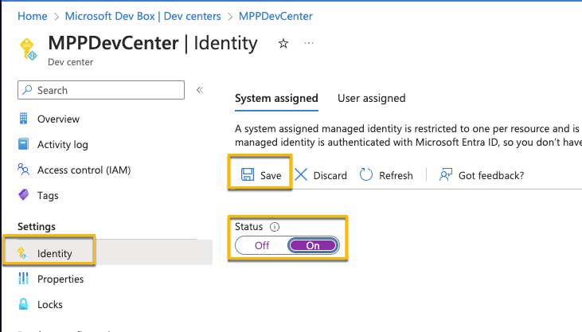
2. Navigate to the Compute Gallery you created and open Access Control (IAM). Grant the managed identity the Managed Application Contributor Role.
   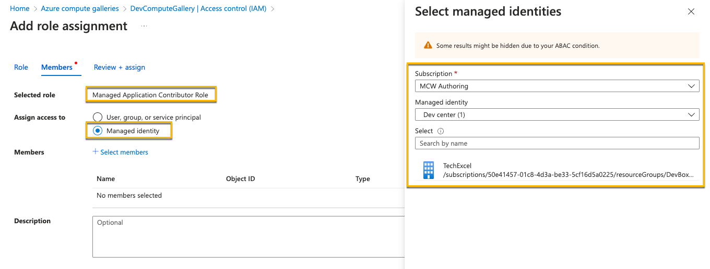
3. Once it's been enabled and the permissions added, back in the Dev Center and add the compute gallery that was created in Task 2.
   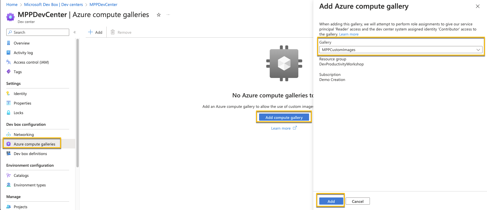
4. Go to you Dev box definitions, and create a new definition. Use the image you created in Task 2.
    -**Note**: The verification of the definition can also take some time to complete. If it hasn't completely after about 20 minute, students can proceed to continue on with exercise 2 and using their own machines or create a standard dev box definition and use that dev box. They can check on that status periodically, and once it completes, finish up Task 3. It's OK to use there machine for Day 1 and use the Dev Box (standard or custom) on day 2.
   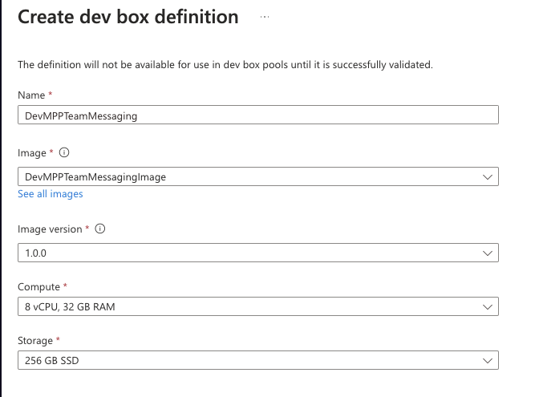
5. After the definition has been created and the image status verified, go to Projects and open up your MPPTeamMessagingSystem Project
   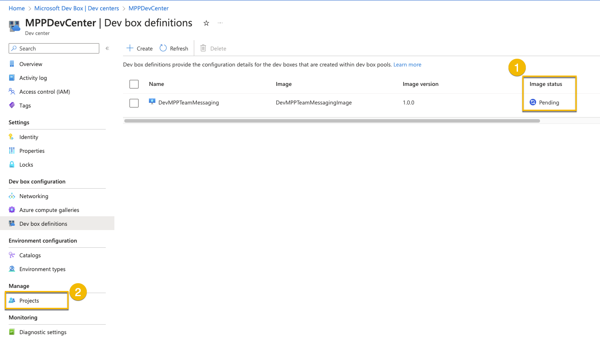

Part 2: Expand this section for the solution to setup a dev box pool with your definition

1. Navigate to Manage dev box pools, and create a dev box pool
   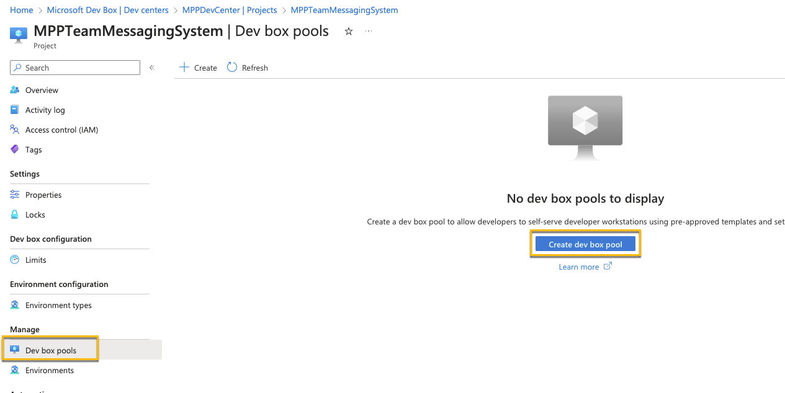
2. Configure the settings as seen below. Use your Dev Box Definition (standard or custom) you just created as well as the network connection you created in Task 1. You may also want to adjust the auto-stop time
   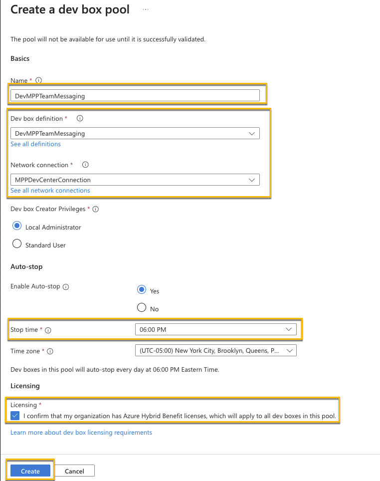
3. Finally, for the Project, under Access control, assign yourself and any other users to be a "DevCenter Dev Box Users"
    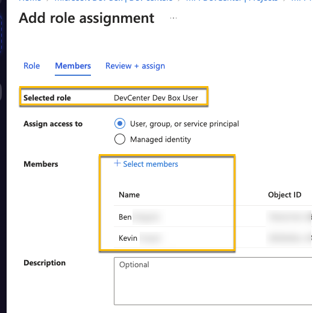
4. Log into your dev box and install the software you'll need for the rest of the training
   - If you used your custom image, install:
     - Docker
   - If your validation failed and you used a standard image, install the following.
     - Docker ([https://docs.docker.com/desktop/install/windows-install/](https://docs.docker.com/desktop/install/windows-install/))
     - Visual Studio Code ([https://code.visualstudio.com/Download](https://code.visualstudio.com/Download))
     - Java (for JMeter) ([https://www.java.com/en/download/](https://www.java.com/en/download/))
     - Apache JMeter ([https://dlcdn.apache.org//jmeter/binaries/apache-jmeter-5.6.3.zip](https://dlcdn.apache.org//jmeter/binaries/apache-jmeter-5.6.3.zip))
     - Azure Storage Explorer ([https://azure.microsoft.com/products/storage/storage-explorer/](https://azure.microsoft.com/products/storage/storage-explorer/))
     - Git bash ([https://git-scm.com/download/win](https://git-scm.com/download/win))
     - .NET SDK 8.0 LTS ([https://dotnet.microsoft.com/download/visual-studio-sdks](https://dotnet.microsoft.com/download/visual-studio-sdks))
     - Firefox ([https://www.mozilla.org/en-US/firefox/new/](https://www.mozilla.org/en-US/firefox/new/))

