# Task 04 - Branching & Policies (20 minutes)

## Introduction

In the previous exercises, we successfully implemented an end-to-end CI/CD pipeline! However, the current workflow will immediately promote every small change directly to production. This isn't an ideal scenario, especially when Munson's Pickles and Preserves is making updates to the Team Messaging System after it's been promoted to production or is even in the testing phase. Best practices are to avoid working directly against the main branch in your repository to avoid conflicts and protect the production environment.

With GitHub, Munson's Pickles and Preserves can solve these challenges using a practice called branching. Some may refer to this as the [GitHub flow](https://guides.github.com/introduction/flow/). When a developer wants to make a change, add a feature, or fix a bug, the developer begins by creating a new 'branch' or copy of the main codebase. Then, the developer makes changes and commits them. A pull request is created to merge these changes back into the main branch. This pull request may or may not involve some testing, discussion and approval. Finally, changes are merged back into the main codebase, and the branch can be deleted.

## Description

In this task, you will practice the GitHub flow. Additionally, GitHub offers a feature for explicitly protecting against changes directly to the main branch. These are called branch protection rules, and you will start by implementing one.

1. Ask GitHub Copilot, "Why should I enable branch protection on a GitHub repository?" to learn about the benefits of branch protection.
2. Create a branch protection rule which prevents developers from committing changes to the main branch in the repository.
3. Create a feature branch, make a small change to the code (i.e.,`/src/Application/src/RazorPagesTestSample/Pages/Index.cshtml`) with the help of GitHub Copilot, and sync this branch with the GitHub repository.
4. Ask GitHub Copilot, "What do I need in a codeowners file?" Then, define a code owner for the `/src/Application` directory using GitHub Copilot. Your branch policy should require a review from the code owner.
5. Create and complete a Pull Request, merging your code change into the protected branch. Use GitHub Copilot to define the pull request message.

## Success Criteria

- You have a branch protection rule which prevents changes from being committed to your main branch.
- Changes to the application (i.e.,`/src/Application/src/RazorPagesTestSample/Pages/Index.cshtml`) are committed to a feature branch.
- Before a pull request is completed:
  - A code owner must approve the changes ([hint](https://docs.github.com/en/free-pro-team@latest/github/creating-cloning-and-archiving-repositories/about-code-owners))
- A completed pull request merges with the protected branch and is automatically deployed to the dev environment.

## Learning Resources

- [General information about protected branches](https://docs.github.com/en/github/administering-a-repository/about-protected-branches)
- [Protected branches configuration specifics here](https://docs.github.com/en/github/administering-a-repository/configuring-protected-branches).
- [General information about branches](https://docs.github.com/en/github/collaborating-with-issues-and-pull-requests/about-branches)
- [Branching specifics about creation and deletion here](https://docs.github.com/en/github/collaborating-with-issues-and-pull-requests/creating-and-deleting-branches-within-your-repository).
- [General information about pull requests](https://docs.github.com/en/github/collaborating-with-issues-and-pull-requests/about-pull-requests)
- [Create pull request specifics](https://docs.github.com/en/github/collaborating-with-issues-and-pull-requests/creating-a-pull-request)
- [Reviewing pull requests](https://docs.github.com/en/github/collaborating-with-issues-and-pull-requests/reviewing-changes-in-pull-requests).
- [About code owners](https://docs.github.com/en/free-pro-team@latest/github/creating-cloning-and-archiving-repositories/about-code-owners)
- [Enabling required status checks](https://docs.github.com/en/free-pro-team@latest/github/administering-a-repository/enabling-required-status-checks)
- [About required reviews for pull requests](https://docs.github.com/en/free-pro-team@latest/github/administering-a-repository/about-required-reviews-for-pull-requests)
- [Copilot For Pull Requests](https://docs.github.com/en/enterprise-cloud@latest/copilot/github-copilot-enterprise/copilot-pull-request-summaries)

## Tips

- If your GitHub account was created on the 'Free' tier, then in order to create a Branch Protection rule your repository must be public. To change a repository from private to public, visit the 'Settings' tab, and scroll to the bottom where you have the option to 'Change visibility.'
- If using the git command line interface, you can find [a number of sample git commands that are useful for branching](https://gist.github.com/JamesMGreene/cdd0ac49f90c987e45ac). (Make sure to focus on the 'git' commands, rather than 'gitflow'.)
- If using the git command line interface, try adding `--help` after a command to get helpful information about arguments and usage.

## Solution

<details markdown="block">
<summary>Expand this section to view the solution</summary>

1. Go to **Settings**, **Branches**, and select **Add branch protection rule**

   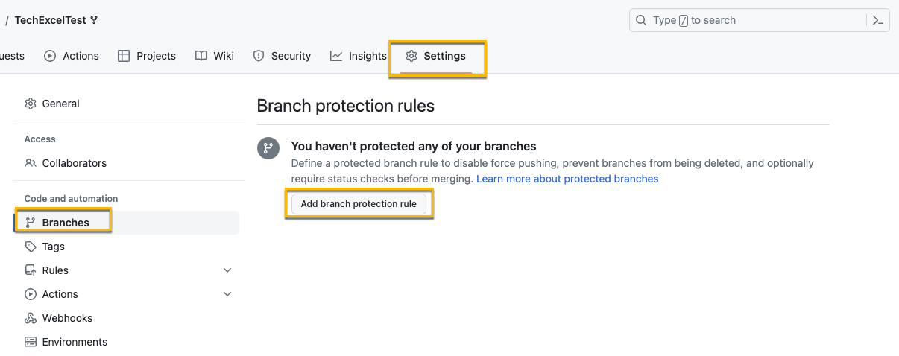

2. For the "Branch name pattern" use `main`. If you wanted this to apply to a certain name format you could also use a regex pattern.
3. Ensure that **Require a pull request before merging** is checked
    - Keep **Require approvals** checked and set the number of approvals to 1
    - Select **Require review from Code Owners**

    

4. Add the `CODEOWNERS` file to specify the code owners for the repo and applications. Start with a prompt along the lines of, "Create a CODEOWNERS file that has {user account} as the owner of /src/Application/" as a first prompt. You may need to provide additional prompts to complete the step.

    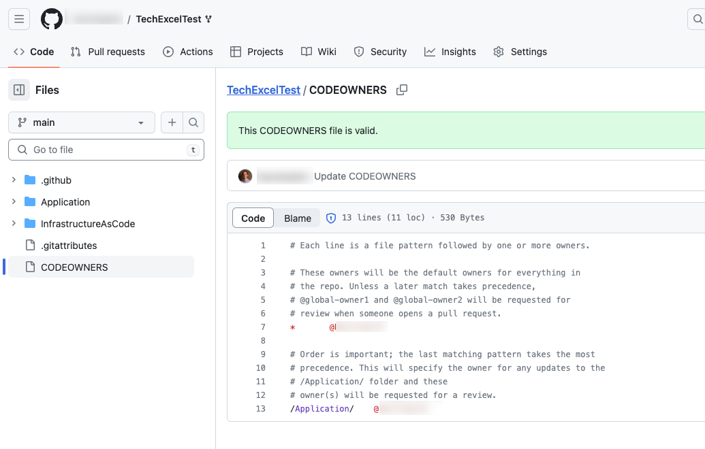

5. Testing the branch protection rules is hard if it is your personal repo and you are the Owner, as Owners can bypass branch protection rules. One way to verify the rule is properly in place it to edit the file in your browser, commit the change, and select the main branch. If the rule is in place, you'll get a warning about bypassing the rules and committing the change.

    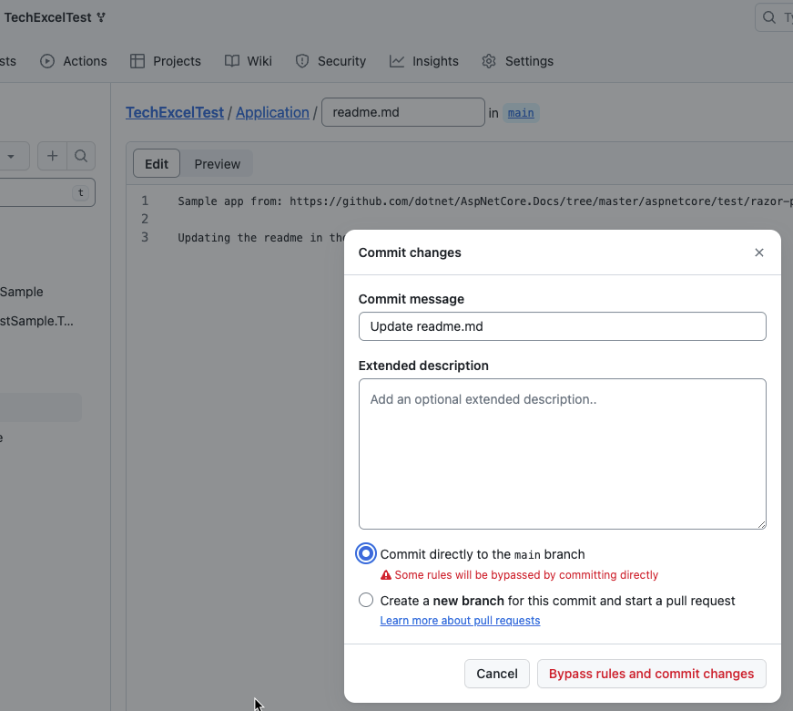

6. If you choose **Create a new branch**, the warning will be removed and you can propose the change.

    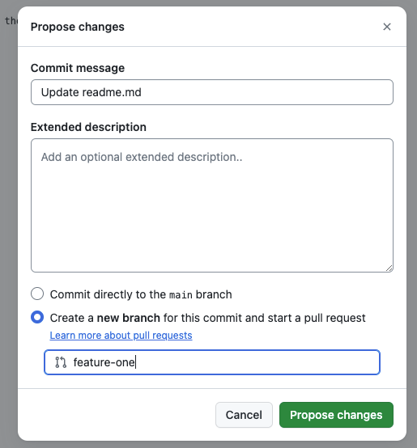

7. Once you've proposed the change in a new branch, you can create a pull request to merge the branch into main. If this is a repository you own, a review is not mandatory because you are able to approve your own commit. To test this, set the approver to the GitHub account of another learner on your team so you test this out.

    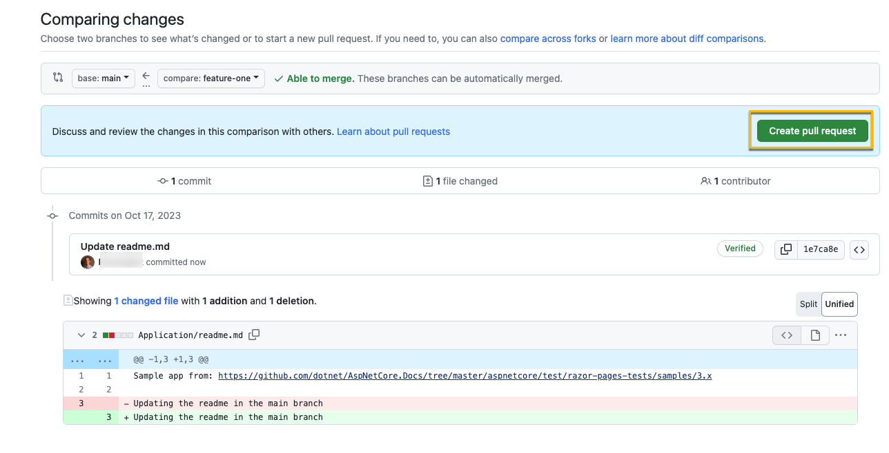

    The screenshot below shows what happens if you are your own approver. You'll see there is nothing in the **Reviewers** section.

    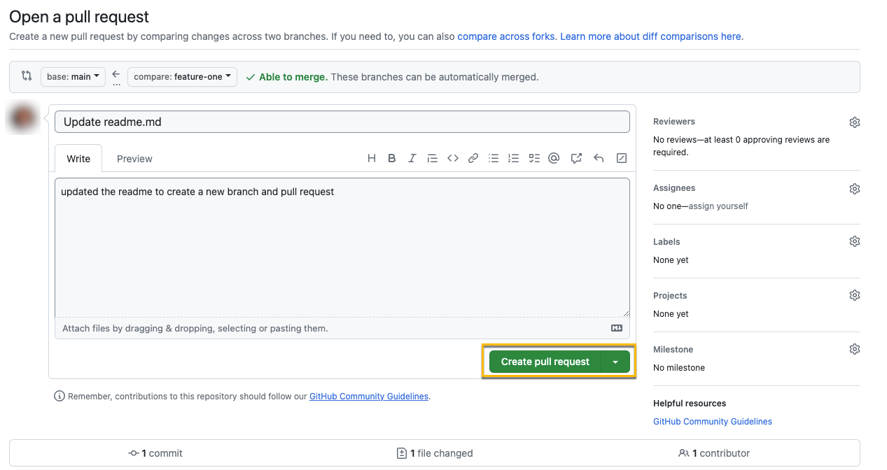

    This screen demonstrate what happens when you set the code owner to another GitHub account: that person will automatically show up in the **Reviewers** section. There are three indicators next to the user:
     - Crescent Moon: *username* will be requested when the pull request is marked ready for review
     - Shield: *username* is a code owner
     - Dot: Awaiting requested review from *username*

    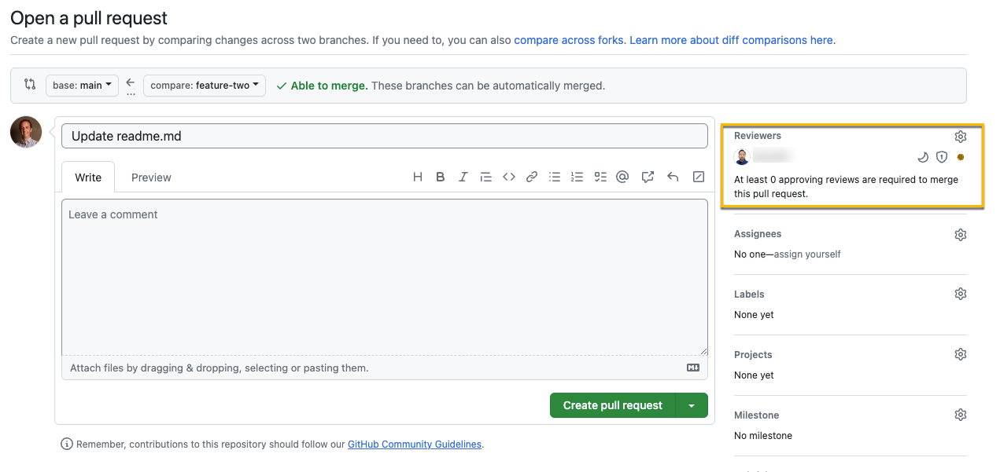

   If you have an active license for GitHub Copilot Enterprise you can use **Copilot for Pull Requests** to generate a summary for the pull request. To do so, select the **Copilot options** button in the **Write** menu and then choose the **Summary** option. This will generate a summary that you can subsequently review and edit as needed.

    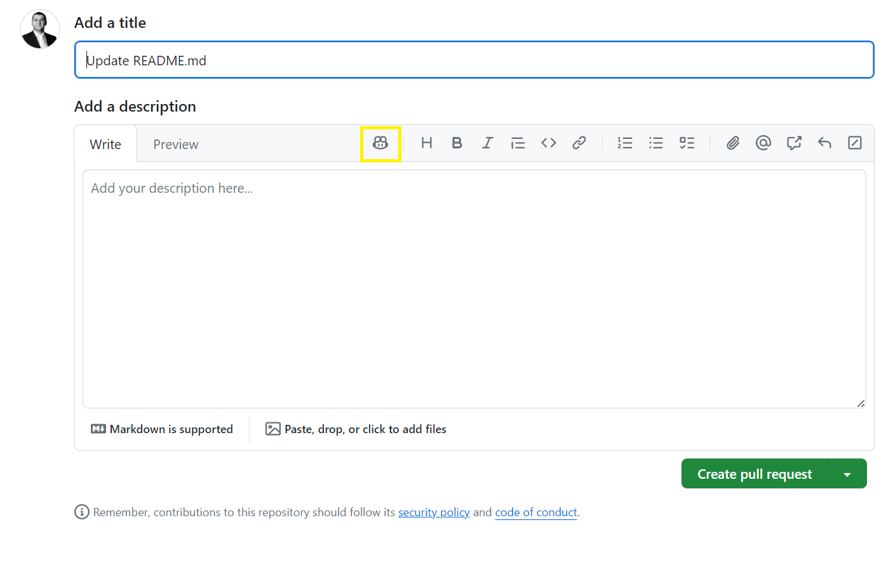

8. When you try to create the pull request, you will see an error indicating that a code owner review is required. As an administrator of the repository, you can bypass the owner review branch protection, but this is a permission only granted to the administrators.

    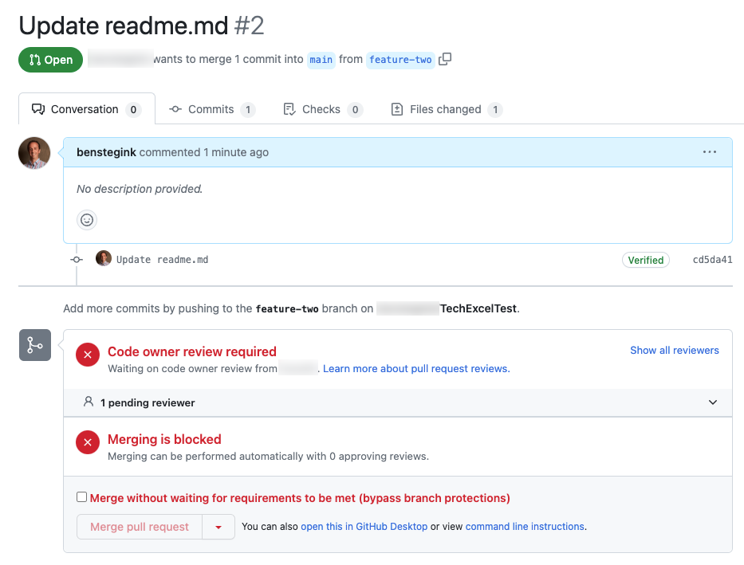

9. Once the pull request has been merged and closed, you can delete the branch.

    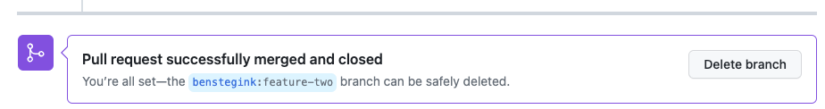

</details>

## Advanced Challenges (optional)

Preventing direct pushes into specific branches like main is a good security practice, but we might wish to take things a step further and introduce manual gating within a GitHub Actions workflow.

Using the .NET deployment workflow you created in Exercise 03, introduce a manual approval step after deploying your .NET web application to the test server and before deploying it to the production server.

## Advanced Challenge Solution

<details markdown="block">
<summary>Expand this section to view the advanced challenge's solution</summary>

In order to require manual approval of a GitHub Actions workflow job, perform the following steps:

1. Navigate to the **Settings** menu. In the **Code and automation** menu, select **Environments**. If you do not already see an environment named "prod," select **New environment** to create a new environment.

    

2. If you need to create a new environment, name it "prod" and select **Configure environment**. If you already have a "prod" environment, select the link.

    

3. Select the **Required reviewers** box and add one or more learners as required reviewers. You may also add team names to the required reviewers list. Then select **Save protection rules** to apply this change.

    

4. Open your .NET deployment YAML file and make sure that you have specified the environment named "prod" in the GitHub Actions workflow job that deploys to production. For example, here is the relevant section from [dotnet-deploy-3.yml](https://github.com/microsoft/TechExcel-Accelerate-developer-productivity-with-GitHub-Copilot-and-Dev-Box/blob/main/Solution/Exercise-03/Task-4/dotnet-deploy-3.yml) with the environment included.

    ```yaml
    deploy-to-prod:
  
    runs-on: ubuntu-latest
    needs: deploy-to-test
    environment:
      name: prod
      url: https://{your_prefix}-prod.azurewebsites.net/
    
    steps:
    - uses: actions/checkout@v3
    
    - name: 'Login via Azure CLI'
      uses: azure/login@v2.1.1
      with:
        creds: ${{ secrets.AZURE_CREDENTIALS }}

    - uses: azure/webapps-deploy@v2
      with:
        app-name: '{your_prefix}-prod'
        images: {your_registry_name}.azurecr.io/techexcel/dotnetcoreapp:${{github.run_number}}
    ```

5. Kick off the GitHub Action workflow. Once it reaches the step whose environment is "prod," the status icon will change to a clock. Select the title of that action to drill into this instance.

    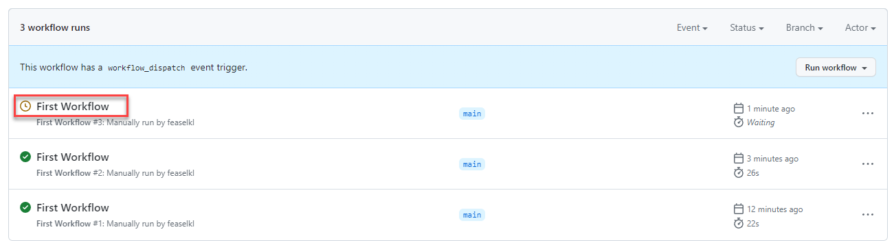

6. For any jobs awaiting approval, you will see the same clock icon. Select the job itself to continue.

    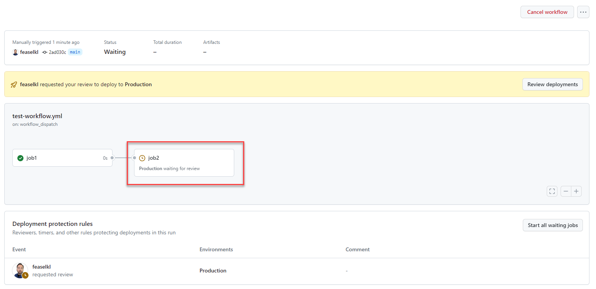

    {: .note }
    > If you are an administrator, you may select the **Start all waiting jobs** button to circumvent the approval process.

7. The job will indicate that it is awaiting approval. Select the **Review pending deployments** link to continue.

    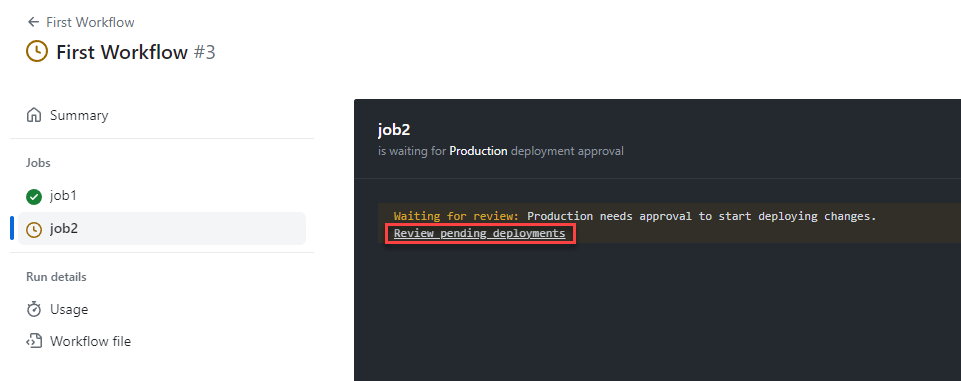

8. For each environment requiring review, you may select that environment's checkbox and leave a comment. Then, select **Approve and deploy** to unblock the workflow.

    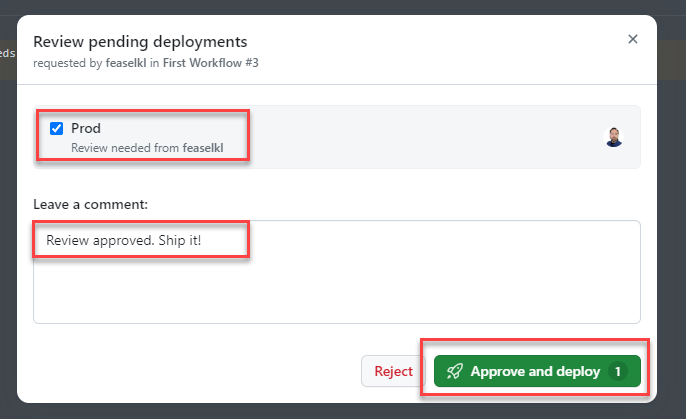

Alternatively, you could use the third-party [Manual Workflow Approval GitHub Action](https://github.com/marketplace/actions/manual-workflow-approval) implement approval.

</details>
