# Task 03 - Implement logging and monitoring (20 minutes)

## Introduction

To wrap up the DevOps journey, Munson's Pickles and Preserves would like to understand what is happening in their deployed environments. By the time users complain about a problem, it is already too late. It is also imperative to know not only about the performance of the site, but also the impact--positive or negative--a feature has had on the users. Please take a moment to review the articles in the **Learning Resources** section to gain a better understanding of the importance of monitoring, as well as Application Insights, one of the tools available in Azure to make monitoring easy.

## Description

In this task, we will look at some of the telemetry that Application Insights has already collected from our running instances. This information is available because we enabled data collection during Exercise 03.

1. Review the `main.bicep` file. Find where the Application Insights node was created and note how the Web App was configured to send its logs there.
2. Create a dashboard in the Azure Portal to provide a summary of the status of our site. ([hint](https://docs.microsoft.com/azure/azure-monitor/app/overview-dashboard#application-dashboard))
3. Implement an outside-in availability test for the homepage of your site. ([hint](https://docs.microsoft.com/azure/azure-monitor/app/monitor-web-app-availability))

## Success Criteria

- You should understand the importance of monitoring and some of the basic features offered by Application Insights.

{: .note }
> We are just scratching the surface of what is offered in Azure Monitoring, if you are interested in learning more there is a full What the Hack focused on [Azure Monitoring](https://github.com/microsoft/WhatTheHack/tree/master/007-AzureMonitoring).

## Learning Resources

- [What is Monitoring?](https://docs.microsoft.com/azure/devops/learn/what-is-monitoring)
- [What is Application Insights?](https://docs.microsoft.com/azure/azure-monitor/app/app-insights-overview)

## Solution

Expand this section to view the solution

1. The App Insights Instrumentation key property is defined here under the **appServiceApp** resource

   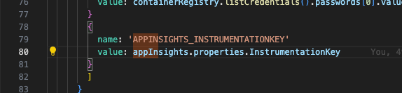

2. The App Insights resource is deployed here in the Bicep script

   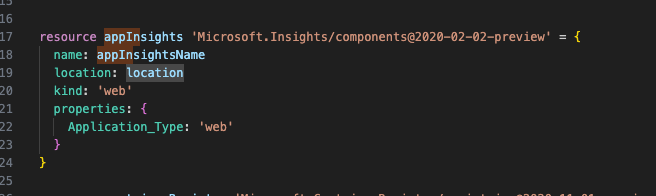

3. Go to **Application Insights** and select **Application Dashboard**.

   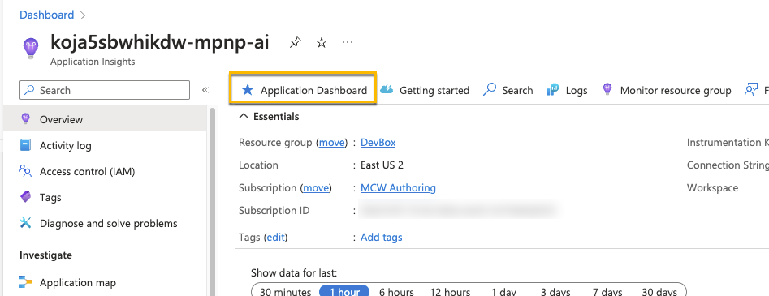

4. Select **Edit** to explore what kinds of changes and updates you can make to the default dashboard.

   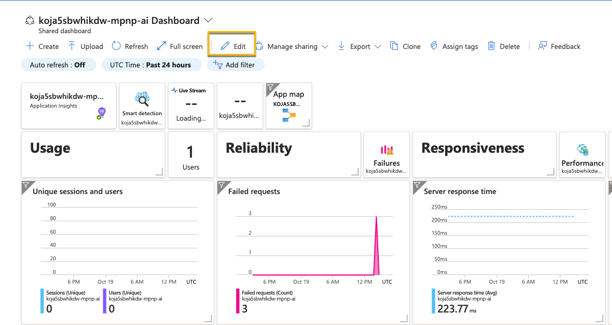

5. After making a few changes, name your new custom dashboard and select **Save** to save it.

   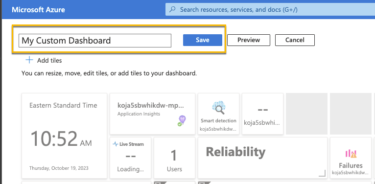

6. Your new custom dashboard is now visible. It is also the new default dashboard for App Services.

   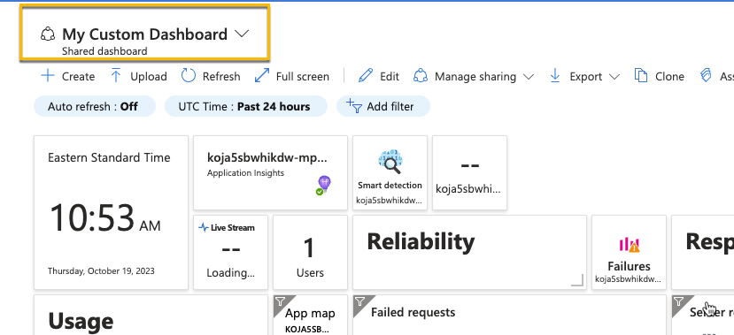

7. Choose **Add Classic test** for your production site.

   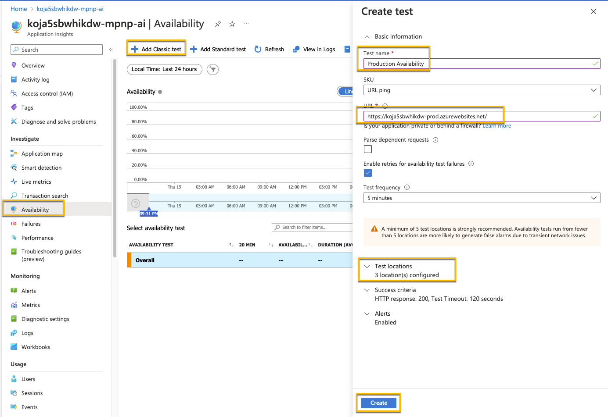

8. Repeat the process for your dev and test sites as well.
9. After a few minutes, you'll start seeing data coming in.

    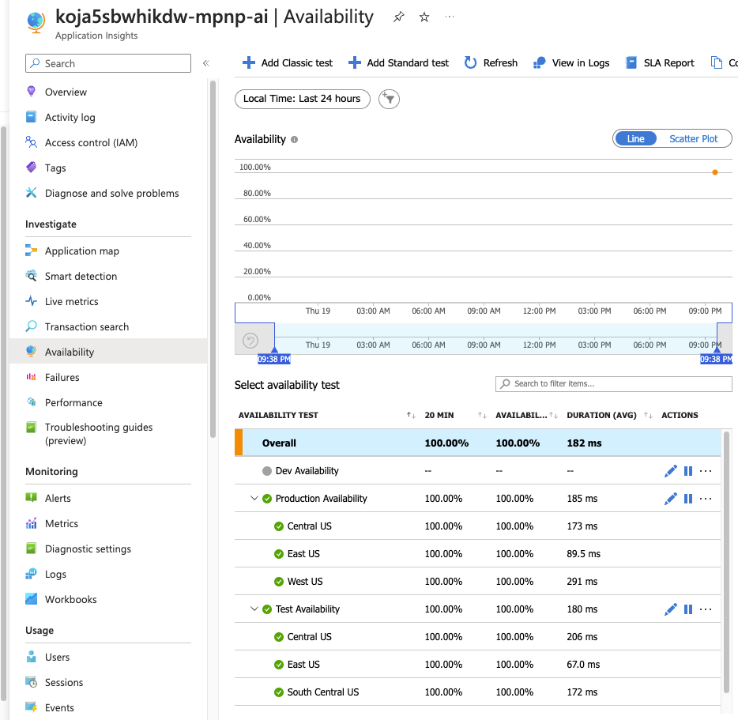

10. To see what happens when an app in unavailable, turn off one of your apps.

    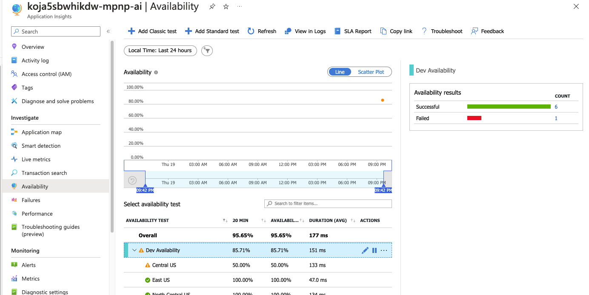

11. If you want alerts based on the site availability, select the ellipsis (**...**) by the test and select **Open rules (Alerts) page**.

    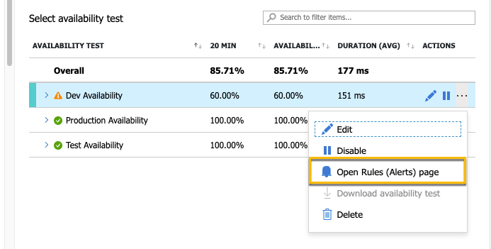

12. There will be a default alert created for failed applications. You can also select **+ Create** if you want add additional rules.

    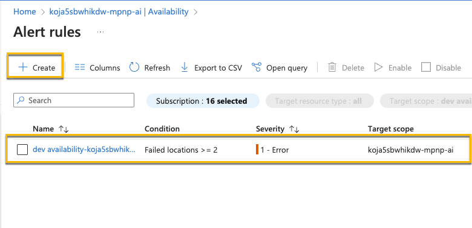

13. Continue exploring and creating additional alerts as desired.

