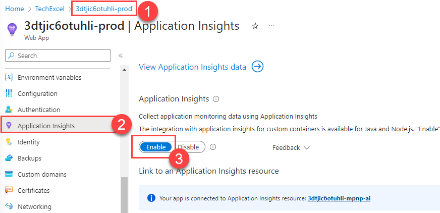
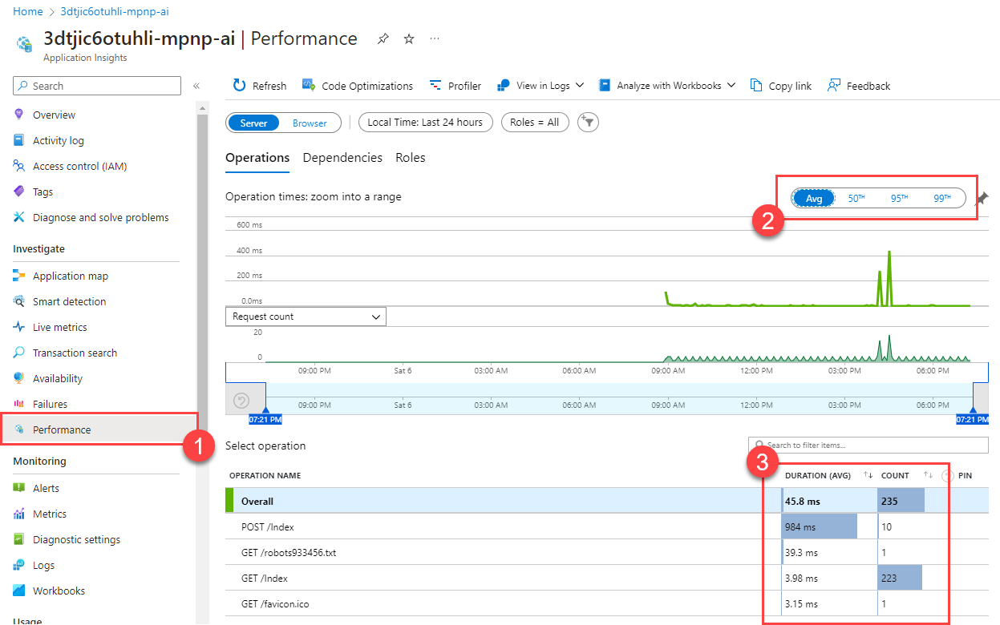
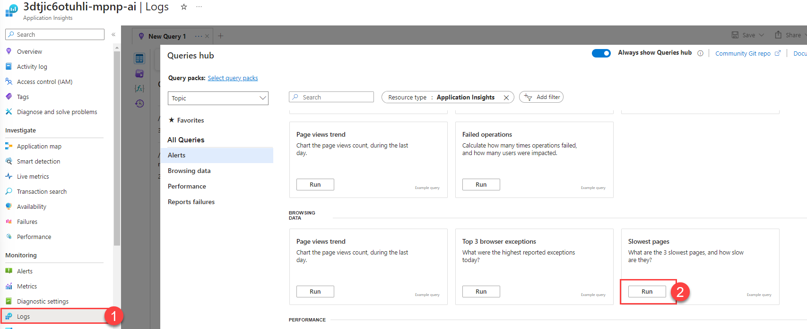
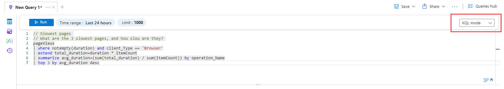
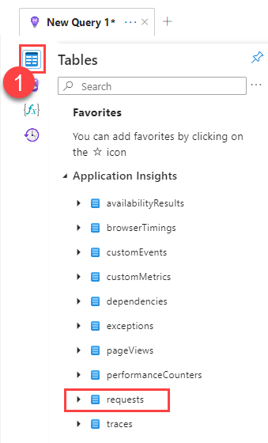
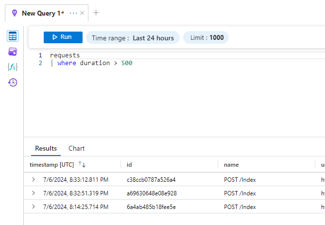
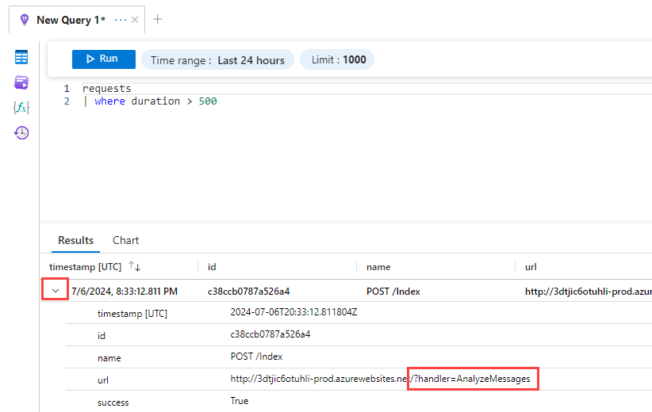
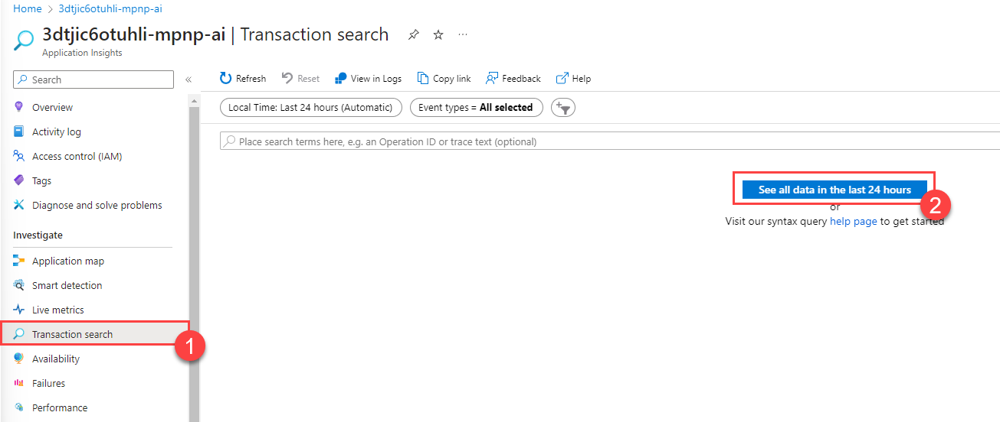
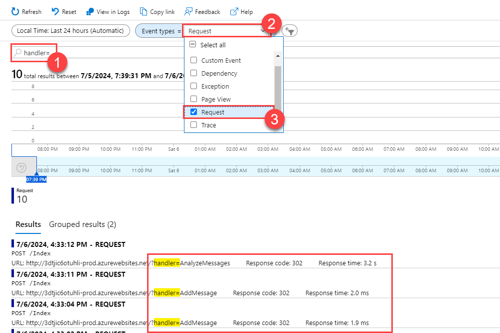

# Task 01 - Find a performance issue with Application Insights (20 minutes)

## Introduction

Now that you have secured the Munson's Pickles and Preserves Team Messaging System, the development team has asked for your assistance once again. It turns out that some users of the Team Messaging System are complaining about performance, but the developers have not been able to uncover the cause of the problem. They would like to see how you can use Azure Application Insights to find performance issues in their application.

## Description

In this task, you will use Azure Application Insights to review application performance and discover the worst-performing code in a simple web application.

1. If you have not done so already, ensure that Application Insights is enabled on your prod App Service.
2. Open the prod Team Messaging System application that you have deployed to Azure Application Services. Try performing various operations in the application, such as adding new messages, deleting existing messages, analyzing messages, and re-loading messages by refreshing the page.
3. Use the **Performance** tab in Application Insights to get an idea of which pages and operations are the worst performing.
4. Use the **Logs** tab in Application Insights to find long-running queries. Use GitHub Copilot to help you write a relevant KQL query.
5. Use the **Transaction search** tab in Application Insights to find the specific operations that are performing poorly.

## Success Criteria

- You know which REST endpoint is performing the worst.
- You know which particular handler is performing worst.

## Learning Resources

- [Application Insights overview](https://learn.microsoft.com/azure/azure-monitor/app/app-insights-overview).
- [System performance counters in Application Insights](https://learn.microsoft.com/azure/azure-monitor/app/performance-counters?tabs=net-core-new).
- [Web App Performance Root Cause Analysis with Application Insights](https://techcommunity.microsoft.com/t5/apps-on-azure-blog/web-app-performance-root-cause-analysis-with-application/ba-p/3805931).

## Tips

- The Team Messaging System uses a querystring parameter called "handler" to separate activities in their single-page application. You may want to search for that term in the **Transaction search** tab.

## Solution

<details markdown="block">
<summary>Expand this section to view the solution</summary>

1. To enable Application Insights on your production web application, navigate to your production App Service in Azure, `{your_random_code}-prod`. Then, navigate to the **Application Insights** tab in the **Settings** menu. Ensure that Application Insights is enabled.

    

2. Open a new tab and navigate to your production website, `{your_random_code}-prod.azurewebsites.net`. Be sure to add several messages, delete several messages, select the **Analyze** button multiple times, and refresh the page. Try a variety of these activities in different orders so you can capture relevant performance data.
3. Open your Application Insights instance, `{your_random_code}-mpnp-ai`. Navigate to the **Performance** tab in the **Investigate** menu. Review the overall performance of each operation. You may also wish to change from the average to the 95th percentile to see if your results look different.

    

    {: .note }
    > You may need to wait several minutes for Application Insights to collect and record performance data. The information should be available within 5 minutes after you have completed testing in your application.

4. Open the **Logs** tab in the **Monitoring** menu. Scroll down in the **Alerts** list and find the **Slowest pages** query. Then, select the **Run** button.

   

5. You might not find any relevant results. In that case, take matters into your own hands! Switch the mode to **KQL mode** and you will see the KQL query itself.

    

6. Select the **Tables** icon to show the available set of tables.

    

    We are using one called **pageViews** but there is another interesting candidate: **requests**.

7. Build a KQL query to filter requests by duration. One way to do this is to make a request to GitHub Copilot like, "Please write a KQL statement that filters requests where duration is greater than 500."

    The response to this should include a response that includes something like the following KQL query:

    ```kql
    requests
    | where duration > 500
    ```

    Paste this query into the query window and select **Run** to return your results.

    

8. All of the long-running requests are `POST` operations against the `/Index` endpoint. Further, drilling into one of these `POST` operations shows that there is a querystring named `handler` that is part of the URL.

    

9. Navigate to the **Transaction search** tab in the **Investigate** menu. Then, select the **See all data in the last 24 hours** button to display results.

    

10. This will return all query results over a 24-hour period. We can then use the search bar to narrow down to operations including "handler=" in the URL. Then, select the "Event types" filter and remove everything except "Request" to display only requests that include "handler=" as part of the stored request data.

    

11. Review the results. You can see that there are two requests, "AnalyzeMessages" and "AddMessage." The AddMessage handler returns within 2-4ms, whereas AnalyzeMessages takes a thousand times as long, clocking in at more than 3 seconds.

    This shows that the "AnalyzeMessages" command appears to be related to the performance slowdown.

</details>
