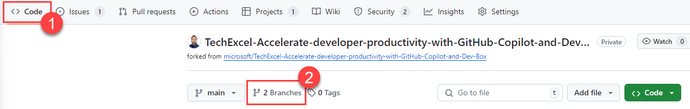

# Task 02 - Remediate in code and create a pull request summary (20 minutes)

## Introduction

In the prior task, you identified which application call is performing the worst. In this task, the MP&P team would like you to use GitHub Copilot to resolve this issue, once again following the Git Flow: creating an Issue, creating a feature branch, resolving the issue, committing changes, creating a pull request, and deploying code out to each environment by way of a GitHub Actions workflow.

## Description

In this task, you will improve the performance of the Team Messaging System.

1. Find the location of the worst-performing code. You may wish to ask GitHub Copilot Enterprise to search for the code if you are not familiar with the layout of a .NET Razor application.
2. Create an Issue and a feature branch associated with your code changes.
3. Use GitHub Copilot to find the underlying cause of why performance is bad.
4. Use GitHub Copilot to make the code faster.
5. Check in your changes and have GitHub Copilot assist on creating the commit message.
6. Create a pull request to the main branch, using GitHub Copilot Enterprise to create a pull request summary. Have another team member review and approve your code before you merge the code into the main branch.
7. Ensure that the deployment completes and your faster (and correct) code is running on the production website.

## Success Criteria

- You have corrected the performance issue in the code.
- You have deployed the code out to each environment.
- You have tested the new code to ensure that it does not change any existing functionality.

## Learning Resources

- [Asking GitHub Copilot questions in GitHub.com](https://docs.github.com/en/enterprise-cloud@latest/copilot/using-github-copilot/asking-github-copilot-questions-in-githubcom).

## Tips

- The GitHub Copilot interface in Visual Studio Code uses as its context your current page. With GitHub Copilot Enterprise, you can ask questions of the entire repository, which may be helpful in finding where the poorly-performing code is located.

## Solution

Expand this section to view the solution

1. In order to [ask an exploratory question about the repository](https://docs.github.com/en/enterprise-cloud@latest/copilot/using-github-copilot/asking-github-copilot-questions-in-githubcom#asking-exploratory-questions-about-a-repository), select the GitHub copilot icon at the top-right of a page. Then, ask a question such as "Where can I find the AnalyzeMessages code?"

    Alternatively, you could perform a code search within Visual Studio Code, looking for this text within the `/src/` directory.
2. Once you have located the relevant code, navigate to your GitHub repository and create a new issue. You can do so either by selecting the **Issues** menu and then selecting the **New issue** button, or by navigating to the **Projects** menu, selecting your Kanban board, and then selecting the **Add Item** option for the **Backlog** card. Enter the text for your issue. If you add via the board, make sure to associate your issue with the repository. Keep track of your issue number for a later commit.
3. Create a feature branch by selecting the **Code** menu for your repository, then selecting the **Branches** link next to the branch drop-down.

   

   After that, select **New branch** and enter a name, such as `performance-improvement`. Select **Create new branch** to complete the process in GitHub. Then, fetch your changes locally and check out the new branch.
4. Return to Visual Studio Code. In the file `src/Application/src/RazorPagesTestSample/Pages/Index.cshtml.cs`, highlight the `OnPostAnalyzeMessagesAsync()` method and ask GitHub Copilot a question such as "Is this code optimized for performance?" The response should indicate several reasons why this is sub-optimal code and offer a modified version that will perform better. Replace the existing code with a faster-running version.
5. Check in your changes, using GitHub Copilot to generate a commit message for you. Be sure to include "Resolves #X" in the commit message, where X is the issue number you created. Push the changes into the remote feature branch.
6. Create a pull request and assign it to another member of your team. Use GitHub Copilot Enterprise to generate a reasonable pull request summary.
7. After your team member completes the code review, complete the merge. Then, navigate to the **Actions** tab and ensure that the **.NET CI** workflow runs successfully.
8. Once deployment completes successfully, navigate to your production website, `{your_random_code}-prod.azurewebsites.net`. Perform the same testing you did in the prior task: add several messages, delete several messages, select the **Analyze** button multiple times, and refresh the page. Try a variety of these activities in different orders so you can ensure functionality remains as it was before, but the performance of the **Analyze** button is significantly faster.

