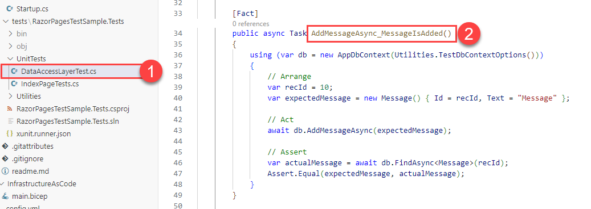
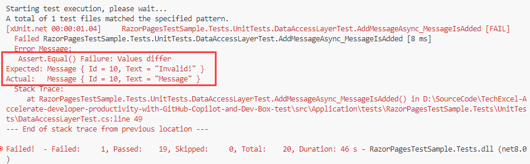
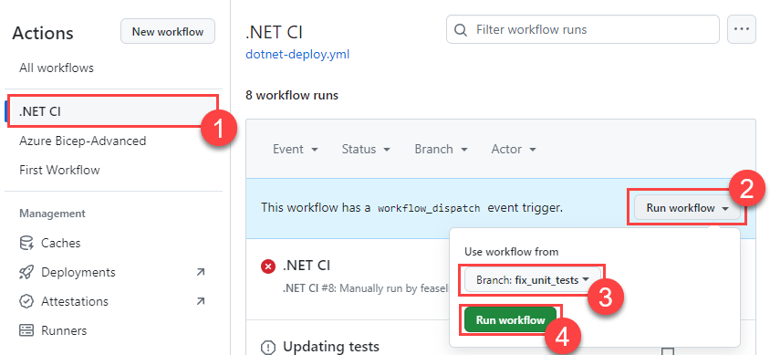
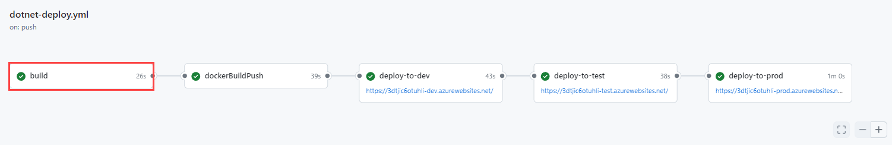
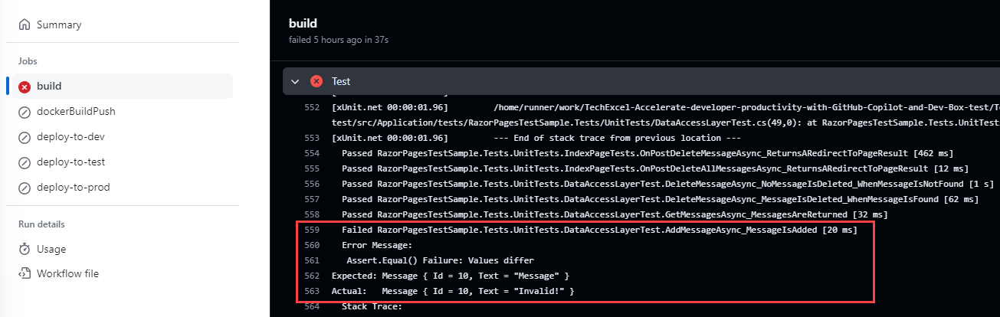

# Task 04 - Fix automated testing and add new tests (20 minutes)

## Introduction

One member of the Munson's Pickles and Preserves development team has just discovered something disturbing: after pulling down a colleague's changes, this developer noticed that unit tests were failing. Despite that, this code made it through the build process successfully.

What the team would like you to do is help them understand why this is happening and what they can do to correct it.

## Description

In this task, you will fix the automated testing that happens as part of the build process and ensure that tests succeed.

1. Create an Issue and a feature branch associated with your automated testing changes.
2. Change the `AddMessageAsync_MessageIsAdded()` test to assert something that is incorrect. Run the unit tests locally and confirm that the test fails. Use GitHub Copilot to assist you in performing these actions.
3. Check in your changes and have GitHub Copilot assist on creating the commit message.
4. Run the .NET CI GitHub Actions workflow against your branch. Observe that the "build" task completes successfully.
5. Modify the .NET CI workflow to run unit tests and commit changes to your branch. Use GitHub Copilot to assist you in creating the commit message.
6. Create a pull request to the main branch, using GitHub Copilot Enterprise to create a pull request summary. Have another team member review and approve your code before you merge the code into the main branch.
7. Ensure that the deployment fails in the "build" task due to a unit test failure.
8. Correct your unit test and use the pull request process to migrate your unit test changes into the main branch. Ensure that the workflow runs successfully.

## Success Criteria

- The .NET CI workflow should fail if unit tests do not build and run successfully.
- After fixing your unit test, the .NET CI workflow should be "green," meaning that all steps have run successfully.

## Learning Resources

- [dotnet test](https://learn.microsoft.com/en-us/dotnet/core/tools/dotnet-test).

## Tips

- The `AddMessageAsync_MessageIsAdded()` function is in `src\Application\tests\RazorPagesTestSample.Tests\UnitTests\DataAccessLayerTest.cs`.
- To ensure that the test fails, you may want to add a fake message, where the `Message()`'s `Text` property is set to something other than "Message" and you assert that the actual message matches your fake message.

## Solution

<details markdown="block">
<summary>Expand this section to view the solution</summary>

This is an abbreviated solution. Read the **Description** section above for all of the steps to perform. This solution will not include tasks that you have performed already, such as creating GitHub Issues, commit messages, or pull requests.

1. Open up the file `src\Application\tests\RazorPagesTestSample.Tests\UnitTests\DataAccessLayerTest.cs` in your repository and navigate to the `AddMessageAsync_MessageIsAdded()` function.

    

2. This test is currently working correctly and will succeed. For the purposes of this task, modify the test to fail. One simple way of doing so is to create another message whose contents do not match our actual message, such as the following:

    ```csharp
    [Fact]
    public async Task AddMessageAsync_MessageIsAdded()
    {
        using (var db = new AppDbContext(Utilities.TestDbContextOptions()))
        {
            // Arrange
            var recId = 10;
            var expectedMessage = new Message() { Id = recId, Text = "Message" };

            // Act
            await db.AddMessageAsync(expectedMessage);
            var fakeMessage = new Message() { Id = recId, Text = "Invalid!" };

            // Assert
            var actualMessage = await db.FindAsync<Message>(recId);
            Assert.Equal(fakeMessage, actualMessage);
        }
    }
    ```

3. In a terminal, navigate to the test directory `src\Application\tests\RazorPagesTestSample.Tests` and then run the command `dotnet test`. It should return a message that one of your tests has failed because the expected value has differed from the actual value in the `AddMessageAsync_MessageIsAdded()` function.

    

    {: .note }
    > If you receive any other type of error message, your unit test project is not configured correctly. Make sure that all of the code is correct and you have the latest version of Newtonsoft.Json in your `RazorPagesTestSample.Tests.csproj` file.

4. After committing these changes to your branch, navigate to the **Actions** tab in GitHub and select your .NET CI workflow. Select **Run workflow** and change the branch to the branch you created. Then, select **Run workflow** to execute the worfklow.

    

5. Once the workflow run begins, select the run and observe that the **build** step succeeds despite your broken unit test.

    

6. The root cause of this is in the `dotnet-deploy.yml` file. You can ask a question in GitHub Copilot chat mode, such as "Why are my unit tests not running?" Note that the answer may not be correct. The root cause comes from the way in which we call the unit tests:

    ```yml
    run: dotnet test --no-build --verbosity normal ./src/Application/tests/RazorPagesTestSample.Tests/RazorPagesTestSample.Tests.csproj
    ```

    The `--no-build` flag means that we do not restore package dependencies or build the test library. For this reason, the test step is quietly finishing and not actually running. The solution is to remove the `--no-build` flag.

    ```yml
    run: dotnet test --verbosity normal ./src/Application/tests/RazorPagesTestSample.Tests/RazorPagesTestSample.Tests.csproj
    ```

    An example of this is in the [dotnet-deploy.yml](https://github.com/microsoft/TechExcel-Implementing-DevOps-practices-to-accelerate-developer-productivity/blob/main/Solution/Exercise-05/Task-4/dotnet-deploy.yml) workflow file in the Solution directory.

7. After making this change, you will need to commit code into the main branch for the workflow to run. To do so, you will need to create a pull request and ask a team member to review and approve your changes.

    Once the workflow does run, you should receive an error in the .NET CI workflow during the **build** task and the **Test** step. The error should be the same as the error you received when running the unit tests locally.

    

8. Now that the test is running (and failing) correctly, fix the test such that it works correctly. Commit that change to your feature branch and then create another pull request to main, having a team member review and approve your changes. Once your changes are in, you should see the automated build action succeed once more.

</details>
